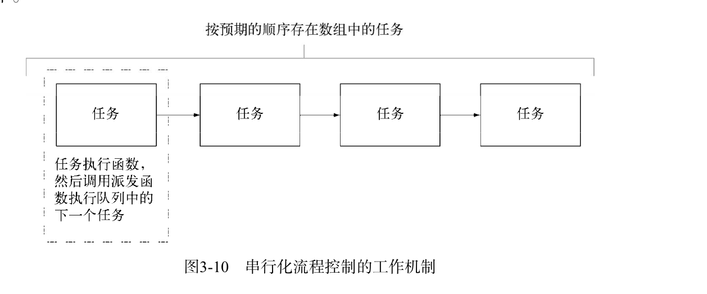
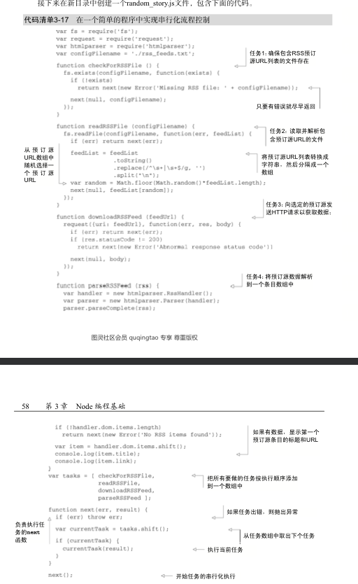
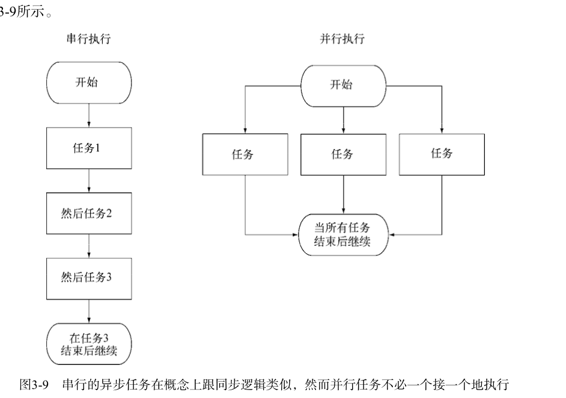
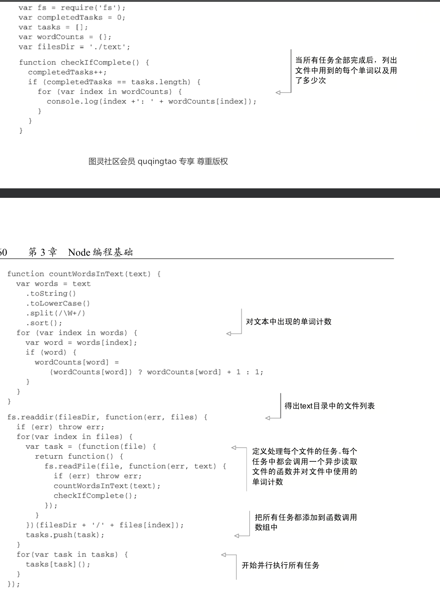

<!--
 * @Author: your name
 * @Date: 2020-05-12 11:27:10
 * @LastEditTime: 2020-06-01 11:21:19
 * @LastEditors: Please set LastEditors
 * @Description: In User Settings Edit
 * @FilePath: /learn_node/node_readme/1.一步编程技术.md
 -->

# 1.
# node的世界里流行两种响应逻辑方式： 回调和事件监听
# 一个Node HTTP 服务器实例就是一个事件发射器，一个可以继承、能够添加事件发射及处理能力的类（EventEmitter）
# Node 的很多核心功能都继承自EventEmitter

# 2. 异步逻辑的顺序化
# 分为 串行执行 和并行执行

# 先说 串行化 工作机制 就是将任务按照预期执行的顺序 放到一个数组里，这个数组将起到队列的作用，完成一个任务后按照顺序从数组中取出下一个 也就是完成一个 将任务从数组中shift 删除工作机制和代码示例

# 并行化 任务并行执行 仍是要把任务放在一个数组里，但是执行的时候 直接for遍历所有要执行的任务
# 所有任务执行完成后，处理器函数执行后续的逻辑

# 当然 这些都有做一定的封装 node 社区有提供的nimble 来实现并行化 和串行化 并行化要被包裹进 parallel这个方法里

# 但是对于串行 和并行的核心逻辑 还是非常值得学习的